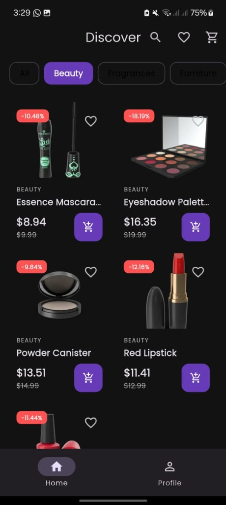
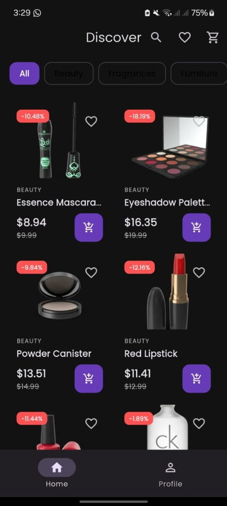
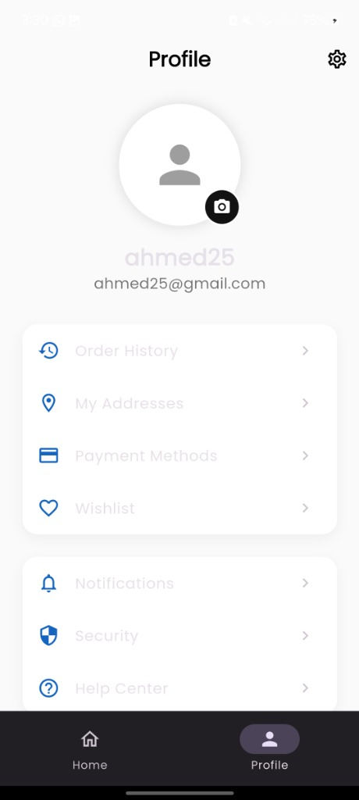
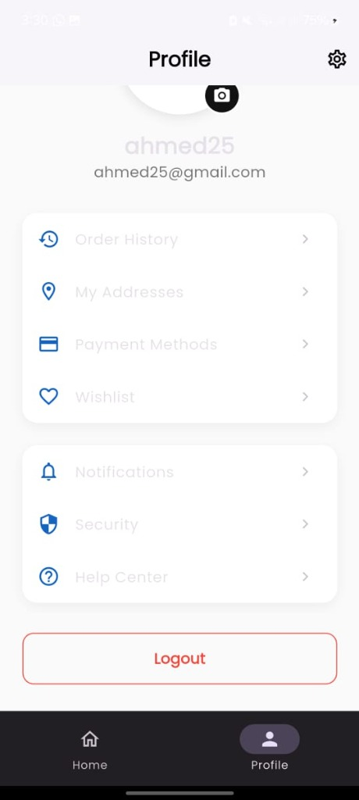
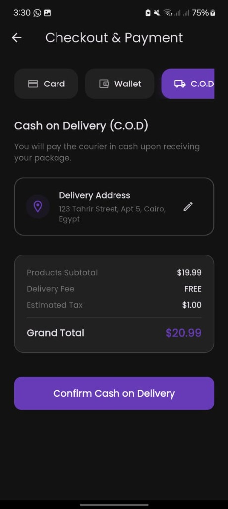
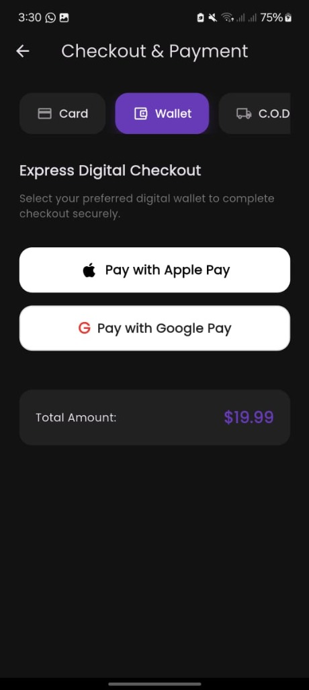

# Ecommerce App 🛒

A premium, highly performant, and feature-rich E-Commerce application built with Flutter following clean architecture boundaries, robust BLoC state management, and strict localized patterns.

---

## 📖 Project Documentation

For complete guidelines and technical guides, refer to the dedicated documentation folders:

*   **[Installation Guide](file:///c:/Users/DELL/Desktop/desktop/Flutter/Ecommerce%20App/docs/INSTALLATION.md)**: Details system prerequisites, Firebase configurations, dotenv setups, and localizations generation.
*   **[API Documentation](file:///c:/Users/DELL/Desktop/desktop/Flutter/Ecommerce%20App/docs/API_DOCUMENTATION.md)**: Outlines Dio network client interceptors, caching strategies, endpoint integrations, and core data DTO models.
*   **[Deployment Guide](file:///c:/Users/DELL/Desktop/desktop/Flutter/Ecommerce%20App/docs/DEPLOYMENT.md)**: Guides you through keystore generations, production builds, App Store/Play Store delivery tracks, CI/CD pipeline automation, and crash reporting integration.

---

## 📱 Screenshots

<div align="center">
  <h4>Discover & Catalogue</h4>
  
  &nbsp;&nbsp;&nbsp;&nbsp;
  
  
  <br/><br/>
  
  <h4>Profile & Account</h4>
  
  &nbsp;&nbsp;&nbsp;&nbsp;
  
  
  <br/><br/>
  
  <h4>Checkout & Payments</h4>
  
  &nbsp;&nbsp;&nbsp;&nbsp;
  
</div>

---

## 🚀 Key Highlights

*   **Secure Persistent Authentication**: Fully integrates secure local cache encryption with native Firebase Auth sessions.
*   **Category-Specific Data Loading**: High-speed, performant pagination that queries remote category API endpoints directly instead of client-side filtering.
*   **Wishlist & Cart Modules**: Clean, declarative state routing and custom models mapper utilities avoiding type downcasts.
*   **Credit Card Forms**: Realistic in-app custom card payment sheet with CVV/expiration validations.
*   **Premium Interface Design**: Dark/light system theme modes with Lottie loaders, Shimmer placeholders, and smooth transitions.
*   **Fully Localized**: Context-dependent English and Arabic locales support.

---

## 🛠️ Tech Stack

*   **Framework**: [Flutter](https://flutter.dev)
*   **State Management**: [flutter_bloc](https://pub.dev/packages/flutter_bloc)
*   **Navigation**: [go_router](https://pub.dev/packages/go_router)
*   **Networking**: [Dio](https://pub.dev/packages/dio) with retry mechanisms.
*   **Security**: [flutter_secure_storage](https://pub.dev/packages/flutter_secure_storage) for tokens.
*   **Monitoring**: [sentry_flutter](https://pub.dev/packages/sentry_flutter) & Firebase Analytics.

---

## 📁 Clean Architecture Directory Layout

```text
lib/
├── core/               # App configuration, themes, widgets, and router.
│   ├── network/        # Dio client configurations and secure interceptors.
│   └── widgets/        # Shimmers, animations, and global view frames.
├── features/
│   ├── auth/           # Firebase registration, login, and secure credentials source.
│   ├── products/       # Products catalogue listing, detail galleries, and category filters.
│   ├── cart/           # Shopping cart management and mapper models.
│   ├── wishlist/       # Saved items.
│   ├── profile/        # User accounts details and settings state pages.
│   └── payments/       # Credit card payments check forms.
└── l10n/               # App localization templates (ARB).
```

---

## ⚡ Quick Start

### 1. Configure Environment
Create a `.env` file in the root workspace directory:
```env
BASE_URL=https://dummyjson.com
PRODUCT_LOAD_LIMIT=20
APP_TITLE="Flutter E-Commerce Premium"
```

### 2. Run Pub Get & Build Localizations
```bash
flutter pub get
flutter gen-l10n
```

### 3. Run Verification Tests
```bash
flutter analyze
flutter test
```

### 4. Build/Run App
```bash
flutter run
```
