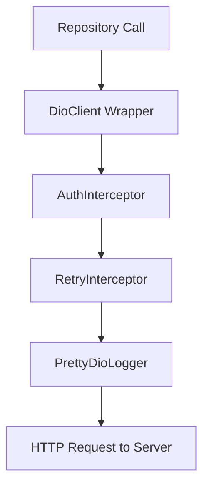

# API Documentation 🔌

This document outlines the API integration layers, endpoints, data models, and request flow within the E-Commerce application.

---

## 🏗️ Networking Architecture

The network client layer is built on top of the [DioClient](file:///c:/Users/DELL/Desktop/desktop/Flutter/Ecommerce%20App/lib/core/network/dio_client.dart) wrapper. It injects a singleton `Dio` client instance and configures:
*   Standard request settings (base URL from `.env`, connection timeouts of 30 seconds).
*   Request retry triggers via `RetryInterceptor`.
*   Authorization headers auto-population.
*   Compact console logger using `PrettyDioLogger` (only enabled in debug mode).



---

## 🔒 Request Interceptors

### 1. [AuthInterceptor](file:///c:/Users/DELL/Desktop/desktop/Flutter/Ecommerce%20App/lib/core/network/interceptors/auth_interceptor.dart)
This interceptor runs before every network request.
*   It retrieves the stored credentials token asynchronously from `FlutterSecureStorage` via `AuthLocalDataSourceImpl`.
*   If a token exists, it appends it to the header payload:
    ```http
    Authorization: Bearer <secure_token>
    ```

### 2. `RetryInterceptor`
Handles transient connection losses or server timeouts.
*   Automatically retries failed requests up to **3 times** with exponential backoff delays (1s, 2s, 3s).

---

## 🌐 Endpoints Configuration

All URLs resolve relative to `ApiConstants.baseUrl` (defaults to `https://dummyjson.com`).

### 1. Products Modules

#### Get All Products
*   **Endpoint:** `/products`
*   **Method:** `GET`
*   **Parameters:**
    *   `skip` (query int): Offset parameter for pagination list indices.
    *   `limit` (query int): Limit of products per load segment.
*   **Response:**
    ```json
    {
      "products": [
        {
          "id": 1,
          "title": "Essence Mascara Lash Princess",
          "price": 9.99,
          "description": "The Essence Mascara Lash Princess...",
          "category": "beauty",
          "thumbnail": "...",
          "images": ["..."],
          "rating": 4.94,
          "discountPercentage": 7.17,
          "brand": "Essence",
          "stock": 5,
          "reviews": []
        }
      ],
      "total": 100,
      "skip": 0,
      "limit": 20
    }
    ```

#### Get Product Details
*   **Endpoint:** `/products/{id}`
*   **Method:** `GET`
*   **Response:** Returns a single product JSON object.

#### Search Products
*   **Endpoint:** `/products/search`
*   **Method:** `GET`
*   **Parameters:**
    *   `q` (query string): The search keywords.
*   **Response:** Returns matching products in a lists array.

#### Get Products by Category
*   **Endpoint:** `/products/category/{category_name}`
*   **Method:** `GET`
*   **Response:** Returns products belonging to the target category.

---

## 📦 Data Models

### 1. Product Schema
Implemented inside [ProductModel](file:///c:/Users/DELL/Desktop/desktop/Flutter/Ecommerce%20App/lib/features/products/data/models/product_model.dart) which extends [Product](file:///c:/Users/DELL/Desktop/desktop/Flutter/Ecommerce%20App/lib/features/products/domain/entities/product.dart):
*   `id` (int): Unique identifier.
*   `title` (string): Product name.
*   `price` (double): Price before discount calculations.
*   `description` (string): Full description text.
*   `category` (string): Category name (e.g. beauty, groceries).
*   `thumbnail` (string): Card preview image url.
*   `images` (list of strings): Media detail gallery urls.
*   `rating` (double): Average customer star review scores.
*   `discountPercentage` (double): Discount rate percentage.
*   `brand` (string?): Optional brand name.
*   `stock` (int): Number of items in warehouse.
*   `reviews` (list of `ReviewModel`): List of customer reviews.

### 2. User Schema
Implemented inside [UserModel](file:///c:/Users/DELL/Desktop/desktop/Flutter/Ecommerce%20App/lib/features/auth/data/models/user_model.dart) which extends [User](file:///c:/Users/DELL/Desktop/desktop/Flutter/Ecommerce%20App/lib/features/auth/domain/entities/user.dart):
*   `id` (string): Firebase UID.
*   `email` (string): Account email address.
*   `username` (string): Generated username.
*   `fullName` (string?): User display name.
*   `phoneNumber` (string?): Contact number.
*   `photoUrl` (string?): Avatar image URL.
*   `token` (string): Authorization Bearer token.
